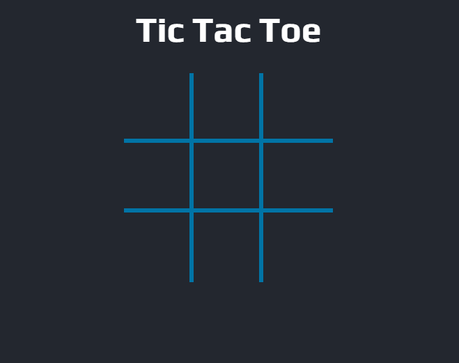
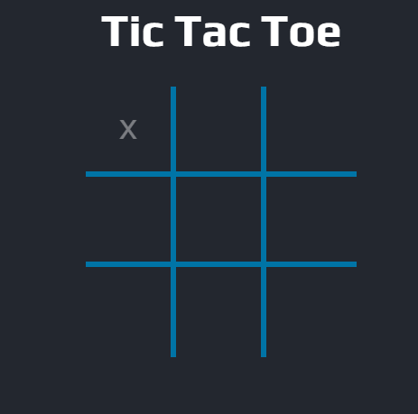
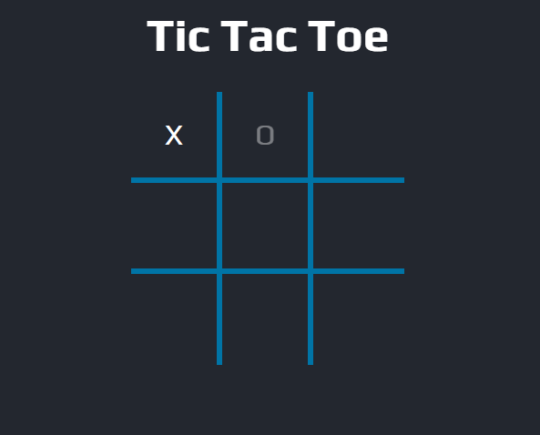
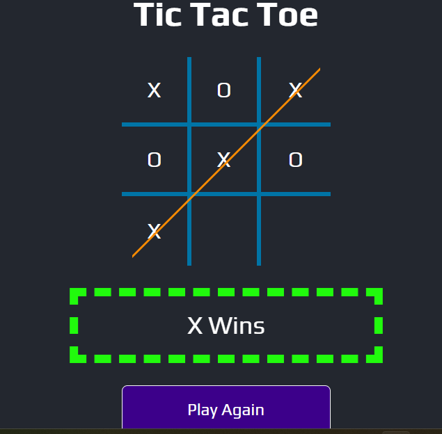
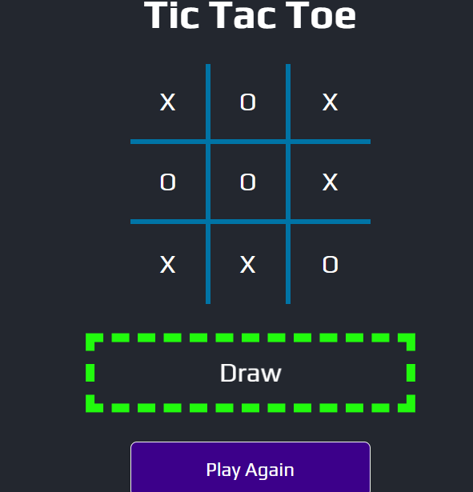

# Tic Tac Toe

Pagina web desarrollando el juego llamado "Tic Tac Toe"
con el framework React.

Asi como en el juego tenemos un jugador que manipula el simbolo "X"
y otro con "O", asi como en el juego se respetan los turnos de cada
jugador y si alguno ya puso su simbolo ya no se puede sobreescribir
ese espacio.
Para facilitarle el usuario y recordar los turnos, aparece en un tono
bajo el simbolo correspondiente.

Cuando uno de los jugadores completa la fila con sus tres simbolos
correspodientes aparecera el mensaje del jugador que gano, asi como
un boton de "Play Again" para que el juego comience de nuevo.
Cabe aclarar que cuando uno de los jugadores gana, ya no se puede
interactuar mas con el tablero.

De igual manera puede ocurrir que ninguno de los dos gane y haya un
empate, la app lo detecta y marca que hay un empate.
